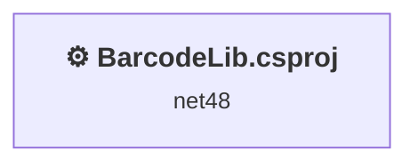
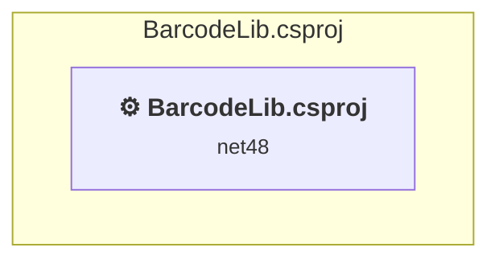

# Projects and dependencies analysis

This document provides a comprehensive overview of the projects and their dependencies in the context of upgrading to .NETCoreApp,Version=v10.0.

## Table of Contents

- [Executive Summary](#executive-Summary)
  - [Highlevel Metrics](#highlevel-metrics)
  - [Projects Compatibility](#projects-compatibility)
  - [Package Compatibility](#package-compatibility)
  - [API Compatibility](#api-compatibility)
  - [Binding Redirect Configuration](#binding-redirect-configuration)
- [Aggregate NuGet packages details](#aggregate-nuget-packages-details)
- [Top API Migration Challenges](#top-api-migration-challenges)
  - [Technologies and Features](#technologies-and-features)
  - [Most Frequent API Issues](#most-frequent-api-issues)
- [Projects Relationship Graph](#projects-relationship-graph)
- [Project Details](#project-details)

  - [BarcodeLib.csproj](#barcodelibcsproj)

## Executive Summary

### Highlevel Metrics

| Metric | Count | Status |
| :--- | :---: | :--- |
| Total Projects | 1 | All require upgrade |
| Total NuGet Packages | 0 | All compatible |
| Total Code Files | 28 |  |
| Total Code Files with Incidents | 3 |  |
| Total Lines of Code | 5691 |  |
| Total Number of Issues | 380 |  |
| Estimated LOC to modify | 378+ | at least 6.6% of codebase |

### Projects Compatibility

| Project | Target Framework | Difficulty | Package Issues | API Issues | Binding Issues | Est. LOC Impact | Description |
| :--- | :---: | :---: | :---: | :---: | :---: | :---: | :--- |
| [BarcodeLib.csproj](#barcodelibcsproj) | net48 | 🟢 Low | 0 | 378 | 0 | 378+ | ClassicClassLibrary, Sdk Style = False |

### Package Compatibility

| Status | Count | Percentage |
| :--- | :---: | :---: |
| ✅ Compatible | 0 | 0.0% |
| ⚠️ Incompatible | 0 | 0.0% |
| 🔄 Upgrade Recommended | 0 | 0.0% |
| ***Total NuGet Packages*** | ***0*** | ***100%*** |

### API Compatibility

| Category | Count | Impact |
| :--- | :---: | :--- |
| 🔴 Binary Incompatible | 0 | High - Require code changes |
| 🟡 Source Incompatible | 378 | Medium - Needs re-compilation and potential conflicting API error fixing |
| 🔵 Behavioral change | 0 | Low - Behavioral changes that may require testing at runtime |
| ✅ Compatible | 5782 |  |
| ***Total APIs Analyzed*** | ***6160*** |  |

## Aggregate NuGet packages details

| Package | Current Version | Suggested Version | Projects | Description |
| :--- | :---: | :---: | :--- | :--- |

## Top API Migration Challenges

### Technologies and Features

| Technology | Issues | Percentage | Migration Path |
| :--- | :---: | :---: | :--- |
| GDI+ / System.Drawing | 376 | 99.5% | System.Drawing APIs for 2D graphics, imaging, and printing that are available via NuGet package System.Drawing.Common. Note: Not recommended for server scenarios due to Windows dependencies; consider cross-platform alternatives like SkiaSharp or ImageSharp for new code. |

### Most Frequent API Issues

| API | Count | Percentage | Category |
| :--- | :---: | :---: | :--- |
| T:System.Drawing.Image | 58 | 15.3% | Source Incompatible |
| T:System.Drawing.Imaging.ImageFormat | 31 | 8.2% | Source Incompatible |
| T:System.Drawing.StringAlignment | 27 | 7.1% | Source Incompatible |
| P:System.Drawing.Image.Width | 20 | 5.3% | Source Incompatible |
| P:System.Drawing.Image.Height | 15 | 4.0% | Source Incompatible |
| T:System.Drawing.Graphics | 12 | 3.2% | Source Incompatible |
| T:System.Drawing.Font | 10 | 2.6% | Source Incompatible |
| P:System.Drawing.Font.Height | 10 | 2.6% | Source Incompatible |
| T:System.Drawing.RotateFlipType | 9 | 2.4% | Source Incompatible |
| T:System.Drawing.Drawing2D.CompositingQuality | 9 | 2.4% | Source Incompatible |
| T:System.Drawing.Drawing2D.PixelOffsetMode | 9 | 2.4% | Source Incompatible |
| T:System.Drawing.Drawing2D.InterpolationMode | 9 | 2.4% | Source Incompatible |
| T:System.Drawing.Drawing2D.SmoothingMode | 9 | 2.4% | Source Incompatible |
| M:System.Drawing.Graphics.DrawLine(System.Drawing.Pen,System.Drawing.Point,System.Drawing.Point) | 9 | 2.4% | Source Incompatible |
| T:System.Drawing.Drawing2D.PenAlignment | 9 | 2.4% | Source Incompatible |
| P:System.Drawing.StringFormat.Alignment | 8 | 2.1% | Source Incompatible |
| T:System.Drawing.SolidBrush | 6 | 1.6% | Source Incompatible |
| M:System.Drawing.SolidBrush.#ctor(System.Drawing.Color) | 6 | 1.6% | Source Incompatible |
| M:System.Drawing.Graphics.FromImage(System.Drawing.Image) | 6 | 1.6% | Source Incompatible |
| F:System.Drawing.StringAlignment.Near | 4 | 1.1% | Source Incompatible |
| T:System.Drawing.Pen | 4 | 1.1% | Source Incompatible |
| M:System.Drawing.Pen.#ctor(System.Drawing.Color,System.Single) | 4 | 1.1% | Source Incompatible |
| T:System.Drawing.Bitmap | 4 | 1.1% | Source Incompatible |
| M:System.Drawing.Image.Save(System.IO.Stream,System.Drawing.Imaging.ImageFormat) | 3 | 0.8% | Source Incompatible |
| T:System.Drawing.Drawing2D.GraphicsState | 3 | 0.8% | Source Incompatible |
| M:System.Drawing.Graphics.Save | 3 | 0.8% | Source Incompatible |
| F:System.Drawing.Drawing2D.CompositingQuality.HighQuality | 3 | 0.8% | Source Incompatible |
| P:System.Drawing.Graphics.CompositingQuality | 3 | 0.8% | Source Incompatible |
| F:System.Drawing.Drawing2D.PixelOffsetMode.HighQuality | 3 | 0.8% | Source Incompatible |
| P:System.Drawing.Graphics.PixelOffsetMode | 3 | 0.8% | Source Incompatible |
| F:System.Drawing.Drawing2D.InterpolationMode.HighQualityBicubic | 3 | 0.8% | Source Incompatible |
| P:System.Drawing.Graphics.InterpolationMode | 3 | 0.8% | Source Incompatible |
| F:System.Drawing.Drawing2D.SmoothingMode.HighQuality | 3 | 0.8% | Source Incompatible |
| P:System.Drawing.Graphics.SmoothingMode | 3 | 0.8% | Source Incompatible |
| M:System.Drawing.Graphics.DrawImage(System.Drawing.Image,System.Single,System.Single) | 3 | 0.8% | Source Incompatible |
| F:System.Drawing.StringAlignment.Center | 3 | 0.8% | Source Incompatible |
| P:System.Drawing.Pen.Alignment | 3 | 0.8% | Source Incompatible |
| T:System.Drawing.GraphicsUnit | 2 | 0.5% | Source Incompatible |
| T:System.Drawing.FontStyle | 2 | 0.5% | Source Incompatible |
| F:System.Drawing.StringAlignment.Far | 2 | 0.5% | Source Incompatible |
| T:System.Drawing.StringFormat | 2 | 0.5% | Source Incompatible |
| M:System.Drawing.StringFormat.#ctor | 2 | 0.5% | Source Incompatible |
| P:System.Drawing.Imaging.ImageFormat.Tiff | 2 | 0.5% | Source Incompatible |
| P:System.Drawing.Imaging.ImageFormat.Png | 2 | 0.5% | Source Incompatible |
| P:System.Drawing.Imaging.ImageFormat.Jpeg | 2 | 0.5% | Source Incompatible |
| P:System.Drawing.Imaging.ImageFormat.Gif | 2 | 0.5% | Source Incompatible |
| P:System.Drawing.Imaging.ImageFormat.Bmp | 2 | 0.5% | Source Incompatible |
| M:System.Drawing.Graphics.Clear(System.Drawing.Color) | 2 | 0.5% | Source Incompatible |
| M:System.Drawing.Bitmap.#ctor(System.Int32,System.Int32) | 2 | 0.5% | Source Incompatible |
| M:System.Data.DataSet.#ctor(System.Runtime.Serialization.SerializationInfo,System.Runtime.Serialization.StreamingContext,System.Boolean) | 2 | 0.5% | Source Incompatible |

## Projects Relationship Graph

Legend:
📦 SDK-style project
⚙️ Classic project

## Project Details

### BarcodeLib.csproj

#### Project Info

- **Current Target Framework:** net48
- **Proposed Target Framework:** net10.0
- **SDK-style**: False
- **Project Kind:** ClassicClassLibrary
- **Dependencies**: 0
- **Dependants**: 0
- **Number of Files**: 29
- **Number of Files with Incidents**: 3
- **Lines of Code**: 5691
- **Estimated LOC to modify**: 378+ (at least 6.6% of the project)

#### Dependency Graph

Legend:
📦 SDK-style project
⚙️ Classic project

### API Compatibility

| Category | Count | Impact |
| :--- | :---: | :--- |
| 🔴 Binary Incompatible | 0 | High - Require code changes |
| 🟡 Source Incompatible | 378 | Medium - Needs re-compilation and potential conflicting API error fixing |
| 🔵 Behavioral change | 0 | Low - Behavioral changes that may require testing at runtime |
| ✅ Compatible | 5782 |  |
| ***Total APIs Analyzed*** | ***6160*** |  |

#### Project Technologies and Features

| Technology | Issues | Percentage | Migration Path |
| :--- | :---: | :---: | :--- |
| GDI+ / System.Drawing | 376 | 99.5% | System.Drawing APIs for 2D graphics, imaging, and printing that are available via NuGet package System.Drawing.Common. Note: Not recommended for server scenarios due to Windows dependencies; consider cross-platform alternatives like SkiaSharp or ImageSharp for new code. |

